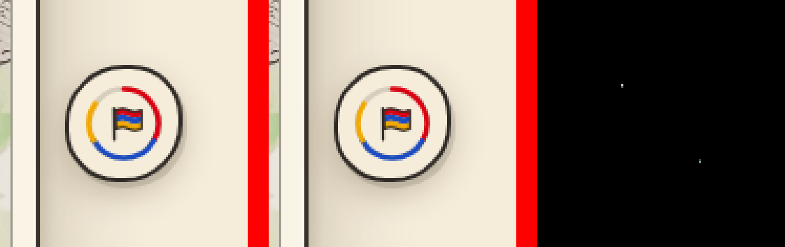
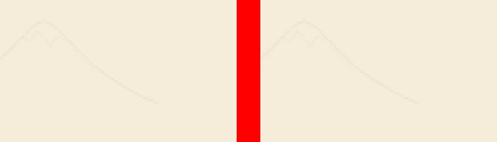

# Аудит 05.10.2026: почему dry-run `publish_building lenin` красный из-за Кукурузника

Отчёт: chka-kitchen/_проверки/2026-10-04-20-06-39 (Mac, Chrome 153, Metal; main = 209a67a).

## 1. beta/kukuruznik ⇄ kukuruznik — 43 из 79: это не публикация
- check_site задаёт зерно случайности от id цели (`hashSeed(target.id|…)`): у `beta/kukuruznik` и `kukuruznik` разные облака, птицы,
  парад. Пара «бета ⇄ живое» поэтому строго не совпадает никогда (то же сказано в build_pages.live_vs_beta). В publish_engine
  эти 43 были «разрешены» именно поэтому.
- Публикация здания бету не трогает: проверка `untouched_problems` подтвердила — beta/ и все её файлы побайтно как на main.
- Решение: publish_building вызывает check_site без пары (`run_check(twins=False)`): бета побайтно не меняется, а пара мерила
  не эту публикацию. Остальные живые здания (Кукурузник) — строго, 0 отличий. Сравнение «бета с самой собой на main» не выбрано:
  оно дублировало бы побайтную проверку и добавило ~40 мин съёмки.

## 2. kukuruznik — 6 из 79: изменения нет, это нестабильность съёмки
Доказательство, что публикация Кукурузник не меняет:
- В коммит идут только lenin/, index.html, 404.html. Страница Кукурузника и все её файлы (93 зависимости index.html, 31 у about/history,
  `build_pages.page_deps`) — ни один не входит в этот список. Движок не загружает ни главную, ни 404.html, ни lenin/ (в engine/ нет fetch этих адресов).
- Размер отличий: 1–53 пикселя на снимок, разница 1–10 из 255, только на сглаженных краях.

| снимок | где | пикс. | разница | что там |
|---|---|---|---|---|
| pc/day-f0 | x 1184–1221, y 743–780 | 4 | ≤9 | кончики дуг кольца на кнопке флага (вырезка 1) |
| pc/walk-7-lang-en, -ru, walk-9-parade | x 1404, y 883 (+край панели x 33–34) | 1–3 | 1 (в панели ≤10) | штрих «стены из букв» в углу (вырезка 2) |
| phone/day-f4-events | x 389, y 487–498 | 8 | ≤8 | крайний столбец кадра, живая деталь у края |
| phone/walk-6-lang-hy-sheet | x 259–281, y 462–475 | 53 | ≤5 | сглаживание «Aa» в шторке сразу после смены языка (вырезка 3) |

Найденные источники «реального времени» в съёмке (в check_site виртуальны только rAF/performance.now/Math.random):
- Стена из букв (wall.js) перестраивается по НАСТОЯЩЕМУ setTimeout через 0,3–1 с после смены классов body (язык, панель, парад) —
  снимок попадал то до, то после перестройки (вырезка 2, край панели).
- После смены языка нужные шрифты догружаются в фоне по реальному времени — строки в шторке сдвигаются на доли пикселя (вырезка 3).
- Chrome подмешивает случайный шум в чтение холста, на котором рисовали текст или фигуры (CanvasNoise, защита от отпечатков):
  открытка (fillText → toBlob) у двух прогонов ОДНОГО И ТОГО ЖЕ сайта разная. Доказано в облаке: 3 вкладки — 3 разных значения
  пикселя заливки #f5ecda; с `--disable-features=CanvasNoise` — 3 одинаковых. Прогон «main против main» (облако) без этого флага
  красный только на открытке.
- Кольцо флага (pc/day-f0) и скруглённые углы миниатюр: частичная перерисовка плиток Chrome — перерисовывается только изменившаяся
  часть поверх старой, итог зависит от того, какие промежуточные кадры успели нарисоваться в реальном времени. Доказано в облаке
  «main против main»: без флага — отличия на кольце флага (parade-mid, day-f0) и углах миниатюр; с `--disable-partial-raster` —
  2 прогона подряд (ПК, день, кадр 0 + прогулка) 17 из 17 снимков побайтно, без пересъёмок.
- Крайний столбец кадра (phone/day-f4-events): отдельно не исследован; тот же класс (сглаживание на краю), проверит прогон на Mac.

## 3. Что исправлено (съёмка, не допуск)
- check_site: перед каждым снимком — раскладка + ожидание шрифтов + перестройка стены сейчас тем же кодом (`window.__wallRelayout`),
  если стена уже показана; Chrome запускается с `--disable-features=CanvasNoise` и `--disable-partial-raster`. Зоны допуска, пороги и сравнения не менялись.
- publish_building: без пары «бета ⇄ живое».

(на вырезках: было | стало | разница ×25)
